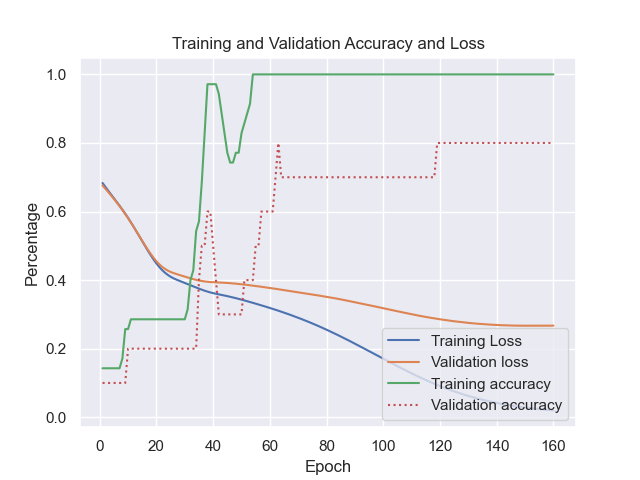
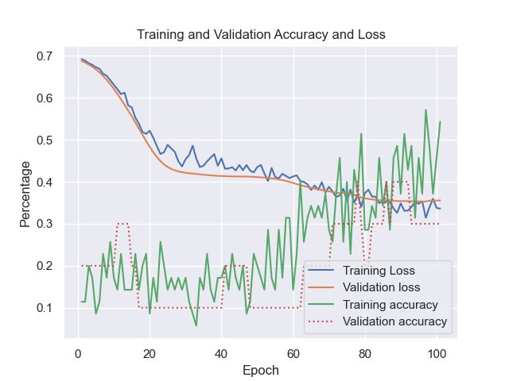

<!-- Improved compatibility of back to top link: See: https://github.com/othneildrew/Best-README-Template/pull/73 -->
<a id="readme-top"></a>
<!--
*** Thanks for checking out the Best-README-Template. If you have a suggestion
*** that would make this better, please fork the repo and create a pull request
*** or simply open an issue with the tag "enhancement".
*** Don't forget to give the project a star!
*** Thanks again! Now go create something AMAZING! :D
-->


<!-- PROJECT SHIELDS -->
<!--
*** I'm using markdown "reference style" links for readability.
*** Reference links are enclosed in brackets [ ] instead of parentheses ( ).
*** See the bottom of this document for the declaration of the reference variables
*** for contributors-url, forks-url, etc. This is an optional, concise syntax you may use.
*** https://www.markdownguide.org/basic-syntax/#reference-style-links
-->
[![Contributors][contributors-shield]][contributors-url]
[![Stargazers][stars-shield]][stars-url]
[![Issues][issues-shield]][issues-url]
[![MIT License][license-shield]][license-url]
[![LinkedIn][linkedin-shield]][linkedin-url]


<!-- PROJECT LOGO -->
<br />
<div align="center">

<h3 align="center">TensorFlow Coronaviruses</h3>

  <p align="center">
    A very simple project I did in 2023 that tests whether a convolutional neural network or recurrent neural network is better for classification of coronavirus RNA.
    <br />
    <br />
    <a href="https://github.com/josephHelfenbein/tf-coronaviruses/issues/new?labels=bug&template=bug-report---.md">Report Bug</a>
    ·
    <a href="https://github.com/josephHelfenbein/tf-coronaviruses/issues/new?labels=enhancement&template=feature-request---.md">Request Feature</a>
  </p>
</div>


<!-- TABLE OF CONTENTS -->
<details>
  <summary>Table of Contents</summary>
  <ol>
    <li>
      <a href="#about-the-project">About The Project</a>
      <ul>
        <li><a href="#built-with">Built With</a></li>
      </ul>
    </li>
    <li>
      <a href="#getting-started">Getting Started</a>
      <ul>
        <li><a href="#prerequisites">Prerequisites</a></li>
        <li><a href="#installation">Installation</a></li>
      </ul>
    </li>
    <li><a href="#license">License</a></li>
    <li><a href="#contact">Contact</a></li>
  </ol>
</details>


<!-- ABOUT THE PROJECT -->
## About the Project
This is a very simple project I did in 2023 for the Long Island Science Congress competition. It's the code for an experiment of whether convolutional neural networks or recurrent neural networks are more accurate for classification of RNA of different types of coronaviruses. Specifically for the recurrent neural network, an LSTM was used.

The data for this project was downloaded from [https://www.ncbi.nlm.nih.gov/nucleotide/](https://www.ncbi.nlm.nih.gov/nucleotide/), and it's all RNA sequences of human-transmitted coronaviruses.

<br />
The training is stopped after the first signs of overfitting, and can be seen here:
<br />
<br />
Convolutional Neural Network Results:



<br />
Recurrent Neural Network (LSTM) Results:



<br />

Because recurrent neural networks typically perform better on language and text data, where the data is very time-based, and convolutional neural networks typically perform better on image data, where the data has more overall patterns, the conclusion to the project was that RNA has patterns more close to an image than to a string of text. However, this experiment can be done better to achieve a more accurate conclusion by using a better recurrent neural network model, setting up the models better, preprocessing the data better, etc.

### Built With

* [![Python][Python]][Python-url]
* [![Tensorflow][Tensorflow]][Tensorflow-url]
* [![Matplotlib][Matplotlib]][Matplotlib-url]
* [![Pandas][Pandas]][Pandas-url]


<p align="right">(<a href="#readme-top">back to top</a>)</p>


<!-- GETTING STARTED -->
## Getting Started

Here are the steps to run the project.

### Prerequisites

* pip
  ```sh
  python -m ensurepip --upgrade
  ```
    (If already installed, make sure it's upgraded)
    ```sh
    pip install --upgrade pip
    ```


### Installation

1. Clone the repo
   ```sh
   git clone https://github.com/josephHelfenbein/tf-coronaviruses.git
   ```
2. Install Python packages
   ```sh
   pip install -r requirements.txt 
   ```
3. You can choose to use the convolutional neural network or the LSTM by uncommenting the chosen model code:
    ```python
    # LSTM
    '''
    model = Sequential()
    model.add(Embedding(vocab_size, 35))
    model.add(Bidirectional(LSTM(32)))
    model.add(Dense(30, activation = 'relu'))
    model.add(Dropout(0.2))
    model.add(Dense(20, activation = 'relu'))
    model.add(Dropout(0.2))
    model.add(Dense(7, activation = 'sigmoid'))
    '''
    # CNN
    '''
    model = Sequential()
    model.add(Embedding(vocab_size, 35, input_length=int(maxlen/3)))
    model.add(Conv1D(32, 7, activation='relu'))
    model.add(MaxPooling1D(5))
    model.add(Conv1D(32, 7, activation='relu'))
    model.add(GlobalMaxPooling1D())
    model.add(Dense(7, activation='sigmoid'))
    '''
    ``` 
4. Run the program using 
    ```sh
    python project.py
    ```
11. If you want to use this code for another project, change git remote url to avoid accidental pushes to base project
   ```sh
   git remote set-url origin josephHelfenbein/tf-coronaviruses
   git remote -v # confirm the changes
   ```


<!-- LICENSE -->
## License

Distributed under the MIT License. See `LICENSE.txt` for more information.


<!-- Acknowledgments  -->
## Acknowledgments 


* [Best README Template](https://github.com/othneildrew/Best-README-Template)

<p align="right">(<a href="#readme-top">back to top</a>)</p>


<!-- MARKDOWN LINKS & IMAGES -->
<!-- https://www.markdownguide.org/basic-syntax/#reference-style-links -->
[contributors-shield]: https://img.shields.io/github/contributors/josephHelfenbein/tf-coronaviruses.svg?style=for-the-badge
[contributors-url]: https://github.com/josephHelfenbein/tf-coronaviruses/graphs/contributors
[forks-shield]: https://img.shields.io/github/forks/josephHelfenbein/tf-coronaviruses.svg?style=for-the-badge
[forks-url]: https://github.com/josephHelfenbein/tf-coronaviruses/network/members
[stars-shield]: https://img.shields.io/github/stars/josephHelfenbein/tf-coronaviruses.svg?style=for-the-badge
[stars-url]: https://github.com/josephHelfenbein/tf-coronaviruses/stargazers
[issues-shield]: https://img.shields.io/github/issues/josephHelfenbein/tf-coronaviruses.svg?style=for-the-badge
[issues-url]: https://github.com/josephHelfenbein/tf-coronaviruses/issues
[license-shield]: https://img.shields.io/github/license/josephHelfenbein/tf-coronaviruses.svg?style=for-the-badge
[license-url]: https://github.com/josephHelfenbein/tf-coronaviruses/blob/master/LICENSE.txt
[linkedin-shield]: https://img.shields.io/badge/-LinkedIn-black.svg?style=for-the-badge&logo=linkedin&colorB=555
[linkedin-url]: https://linkedin.com/in/joseph-j-helfenbein
[product-screenshot]: images/screenshot.png
[Next.js]: https://img.shields.io/badge/next.js-000000?style=for-the-badge&logo=nextdotjs&logoColor=white
[Next-url]: https://nextjs.org/
[Python]: https://img.shields.io/badge/python-3776AB?style=for-the-badge&logo=python&logoColor=white
[Python-url]: https://www.python.org/
[Tensorflow]: https://img.shields.io/badge/tensorflow-FF6F00?style=for-the-badge&logo=tensorflow&logoColor=white
[Tensorflow-url]: https://www.tensorflow.org/
[Matplotlib]: https://img.shields.io/badge/matplotlib-212529.svg?logo=data:image/svg%2bxml;base64,PD94bWwgdmVyc2lvbj0iMS4wIiBlbmNvZGluZz0iVVRGLTgiPz4KPHN2ZyB4bWxucz0iaHR0cDovL3d3dy53My5vcmcvMjAwMC9zdmciIHdpZHRoPSIxODAiIGhlaWdodD0iMTgwIiBzdHJva2U9ImdyYXkiPgo8ZyBzdHJva2Utd2lkdGg9IjIiIGZpbGw9IiNGRkYiPgo8Y2lyY2xlIGN4PSI5MCIgY3k9IjkwIiByPSI4OCIvPgo8Y2lyY2xlIGN4PSI5MCIgY3k9IjkwIiByPSI2NiIvPgo8Y2lyY2xlIGN4PSI5MCIgY3k9IjkwIiByPSI0NCIvPgo8Y2lyY2xlIGN4PSI5MCIgY3k9IjkwIiByPSIyMiIvPgo8cGF0aCBkPSJtOTAsMnYxNzZtNjItMjYtMTI0LTEyNG0xMjQsMC0xMjQsMTI0bTE1MC02MkgyIi8+CjwvZz48ZyBvcGFjaXR5PSIuOCI+CjxwYXRoIGZpbGw9IiM0NEMiIGQ9Im05MCw5MGgxOGExOCwxOCAwIDAsMCAwLTV6Ii8+CjxwYXRoIGZpbGw9IiNCQzMiIGQ9Im05MCw5MCAzNC00M2E1NSw1NSAwIDAsMC0xNS04eiIvPgo8cGF0aCBmaWxsPSIjRDkzIiBkPSJtOTAsOTAtMTYtNzJhNzQsNzQgMCAwLDAtMzEsMTV6Ii8+CjxwYXRoIGZpbGw9IiNEQjMiIGQ9Im05MCw5MC01OC0yOGE2NSw2NSAwIDAsMC01LDM5eiIvPgo8cGF0aCBmaWxsPSIjM0JCIiBkPSJtOTAsOTAtMzMsMTZhMzcsMzcgMCAwLDAgMiw1eiIvPgo8cGF0aCBmaWxsPSIjM0M5IiBkPSJtOTAsOTAtMTAsNDVhNDYsNDYgMCAwLDAgMTgsMHoiLz4KPHBhdGggZmlsbD0iI0Q3MyIgZD0ibTkwLDkwIDQ2LDU4YTc0LDc0IDAgMCwwIDEyLTEyeiIvPgo8L2c+PC9zdmc+&style=for-the-badge&logoColor=white
[Matplotlib-url]: https://matplotlib.org/
[Pandas]: https://img.shields.io/badge/pandas-150458?style=for-the-badge&logo=pandas&logoColor=white
[Pandas-url]: https://pandas.pydata.org/
